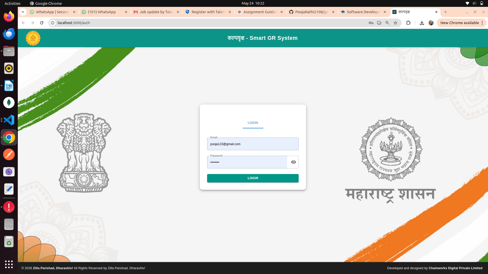

# Government Resolution RAG Chatbot

## Overview
This project is an AI-powered chatbot for querying Government Resolution documents using Retrieval-Augmented Generation (RAG).

The system allows users to upload and search government documents using semantic retrieval and conversational AI techniques.

---

## Features

- User Authentication
- PDF Upload
- Semantic Search
- Conversational Chatbot
- RAG Pipeline
- Vector Database Integration
- Metadata-based Retrieval

---

## Tech Stack

### Frontend
- React.js
- Material UI

### Backend
- Python
- FastAPI

### AI / RAG
- LangChain
- ChromaDB
- Ollama / LLM

---

## Project Structure

government-resolution-rag-chatbot/
├── gr-frontend/
├── gr-backend/
├── screenshots/
├── docs/
├── README.md
└── .gitignore

---

## Setup Instructions

### Frontend

cd gr-frontend
npm install
npm run dev

### Backend

cd gr-backend
pip install -r requirements.txt
uvicorn main:app --reload

---

## Screenshots

### Login Page

### Chatbot UI

---

## Future Improvements

- Hybrid Search
- Streaming Responses
- Better OCR Support
- Multi-document Chat
